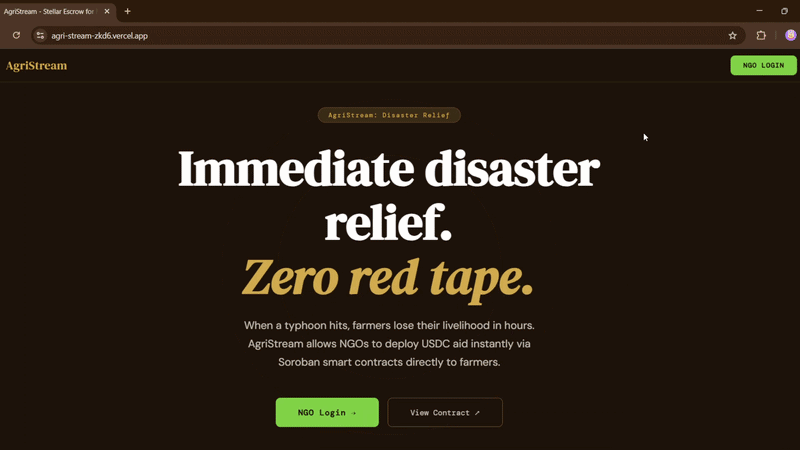
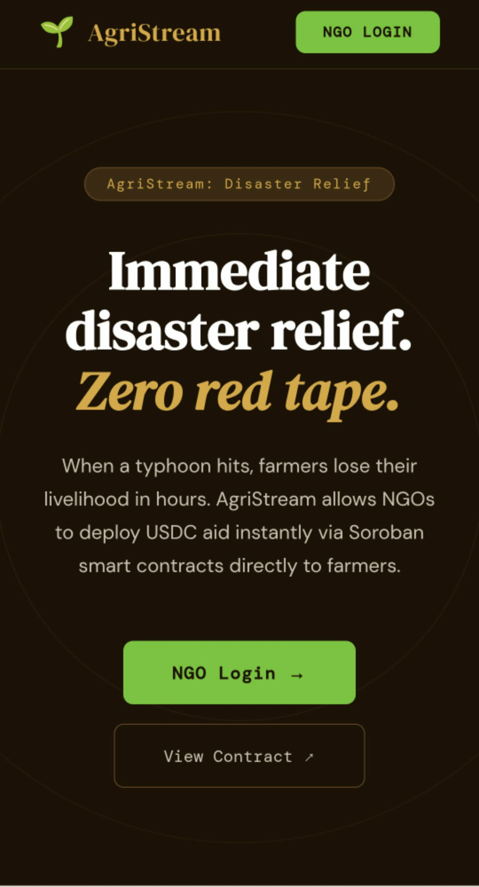
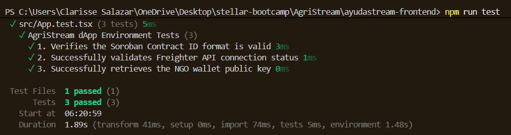
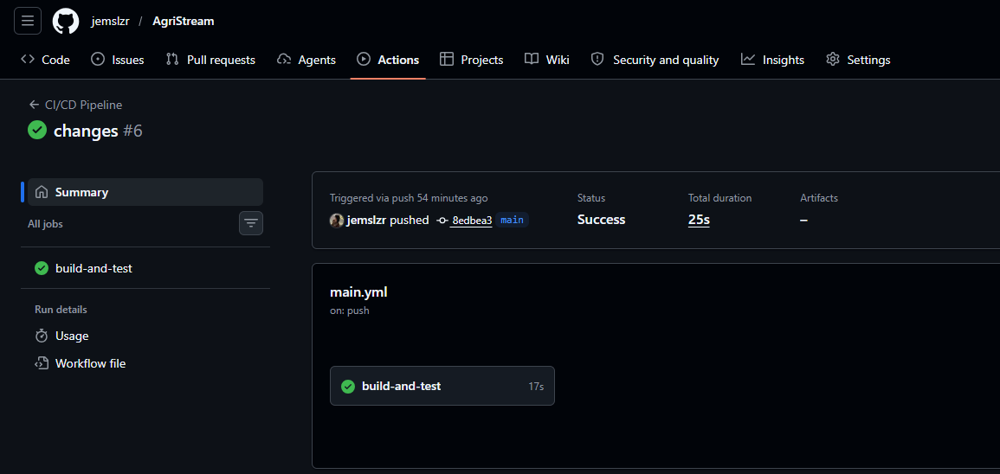

# 🌾 AgriStream

Immediate disaster relief disbursement for Filipino farmers, built on Stellar Soroban.


### 🎯 Target Users
*   **Filipino Farmers:**  Rural small-scale agriculturists needing immediate liquidity post-calamity.
*   **NGOs & Relief Organizations:**  Groups seeking a transparent and rapid way to distribute aid without traditional banking friction.

---

## 🏆 Demonstration

* **Live Demo:** https://agri-stream-zkd6.vercel.app/
* **Demo Video (1-min):**  https://youtu.be/VXvCMJ2TW6A

* **CI/CD Pipeline:** [](#)https://github.com/jemslzr/AgriStream/actions/runs/25145310455
* **Sample Transaction Hash:**  6589fda0f9b49a09c805ddb6798f09686ba9304363352ea729224be733f9813c

### Screenshots
| Mobile Responsive View (L4) |
| :---: |
|  
 Passing Test Output (L3) | CI/CD Pipeline Running (L4) |
|  
 Passing Test Output (L3) | CI/CD Pipeline Running (L4) |
|  |

---

## ⚡ Problem

When a typhoon or natural disaster hits the Philippines, small-scale farmers often lose their entire livelihood in hours. Traditional government or NGO relief funds typically take **2 to 4 weeks** to reach them due to manual verification, bank processing delays, and logistical friction. For a farmer in provinces like Rizal or Central Luzon, this delay leads to a cycle of debt.

## 🛡️ Solution

AgriStream uses **Soroban Smart Contracts** to bypass traditional financial red tape. NGO administrators can pre-fund an escrow contract. When a disaster is declared, the NGO allocates specific amounts of USDC to registered farmers' Stellar addresses instantly. 

* **Funds are instant:** No waiting for bank clearing or manual wire transfers.
* **Escrow Security:** Funds are locked on-chain and can only be claimed by the verified beneficiary.
* **Cost Effective:** Transaction fees are less than PHP 0.50 ($0.01), ensuring nearly 100% of the aid reaches the farmer.

---
## 🌟 Stellar Features Used

| Feature | Usage |
| :--- | :--- |
| **Soroban Smart Contracts** | Implements core `allocate` and `claim` logic for secure, programmed aid. |
| **USDC on Stellar** | Utilized as the primary settlement asset to provide price stability for farmers. |
| **Deterministic Addressing** | Maps unique allocations to Farmer Public Keys to ensure funds reach the intended recipient. |
| **On-Chain Audit Trail** | Every disbursement creates an immutable record on the Stellar ledger for transparency. |

---

## 📜 Smart Contract Functions

The AgriStream logic is written in Rust and deployed as a Soroban smart contract.

| Function | Caller | Description |
| :--- | :--- | :--- |
| `allocate(admin, farmer, amount)` | **NGO Admin** | Authorizes and locks USDC in escrow for a specific farmer's address. |
| `claim(farmer)` | **Farmer** | Transfers the locked relief funds from the contract to the farmer's wallet. |
| `get_allocation(farmer)` | **Anyone** | Read-only check to see the pending relief balance for a specific farmer. |

### Network Details
*   **Contract ID:** `CCXYD7JYJSKI7WWKI7Y7P3DDD4NSL7F3U5EQAF2UUO7QFBRCIEL3FHQE`
*   **WASM Hash:** `4feaab8ac5d7997ce508201004f6b1133d2897f5b9e40d7581ff6db82c5e36fd`

---

## 🛠️ Prerequisites

### For the Smart Contract
*   **Rust & Cargo:** (Latest Stable)
*   **Soroban CLI:** v22.0.0 or higher
*   **WASM Target:** `wasm32-unknown-unknown`

### For the Frontend
*   **Node.js:** v18.0.0 or higher
*   **Freighter Wallet:** Configured to the **Stellar Testnet**
*   **Testnet Assets:** Account funded via Friendbot

---

## ⚙️ Setup & Installation

### 1. Smart Contract
```bash
# Build the contract
stellar contract build

# Optimize for deployment
stellar contract optimize --wasm target/wasm32-unknown-unknown/release/agri_stream.wasm
2. Frontend
Bash
# Navigate to project root
cd ayudastream-frontend

# Install dependencies
npm install

# Start local development server
npm run dev
```

### System Architecture


```bash
Browser (React + Vite + TypeScript)
|-- Freighter Wallet API      (NGO Authentication & Signing)
|-- @stellar/freighter-api    (Wallet Connection)
|-- Soroban RPC               (On-chain State Interaction)

Stellar Testnet
|-- AgriStream Smart Contract (Escrow & Allocation Logic)
|-- USDC Token Contract       (Asset for disbursement)
No traditional database is used for the core ledger. All relief allocations and disbursement states live natively on the Stellar blockchain, ensuring a transparent and tamper-proof audit trail for donors.

📂 Project Structure
├── contracts/
│   ├── src/
│   │   ├── lib.rs              # Soroban contract: allocate, claim, get_allocation
│   │   └── test.rs             # Unit tests for escrow logic
│   └── Cargo.toml
├── frontend/
│   ├── src/
│   │   ├── App.tsx             # Main Dashboard (NGO Portal)
│   │   ├── App.css             # Branded Agricultural Design System
│   │   ├── main.tsx            # Entry point with Buffer polyfills
│   │   └── types.ts            # TypeScript Interfaces
│   ├── index.html
│   └── package.json
├── target/                     # Compiled WASM binaries (Optimized)
└── README.md
```
