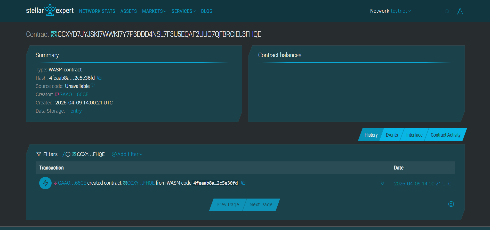

# 🌾 AgriStream

Immediate disaster relief disbursement for Filipino farmers, built on Stellar Soroban.

---

## ⚡ Problem

When a typhoon or natural disaster hits the Philippines, small-scale farmers often lose their entire livelihood in hours. Traditional government or NGO relief funds typically take **2 to 4 weeks** to reach them due to manual verification, bank processing delays, and logistical friction. For a farmer in provinces like Rizal or Central Luzon, this delay leads to a cycle of debt.

## 🛡️ Solution

AgriStream uses **Soroban Smart Contracts** to bypass traditional financial red tape. NGO administrators can pre-fund an escrow contract. When a disaster is declared, the NGO allocates specific amounts of USDC to registered farmers' Stellar addresses instantly. 

* **Funds are instant:** No waiting for bank clearing or manual wire transfers.
* **Escrow Security:** Funds are locked on-chain and can only be claimed by the verified beneficiary.
* **Cost Effective:** Transaction fees are less than PHP 0.50 ($0.01), ensuring nearly 100% of the aid reaches the farmer.

---

## 🏗️ Architecture

Browser (React + Vite + TypeScript)
|-- Freighter Wallet API      (NGO Authentication & Signing)
|-- @stellar/freighter-api    (Wallet Connection)
|-- Soroban RPC               (On-chain State Interaction)

Stellar Testnet
|-- AgriStream Smart Contract (Escrow & Allocation Logic)
|-- USDC Token Contract       (Asset for disbursement)


No traditional database is used for the core ledger. All relief allocations and disbursement states live natively on the Stellar blockchain, ensuring a transparent and tamper-proof audit trail for donors.

---

## 📂 Project Structure

agristream/
├── contracts/
│   ├── src/
│   │   ├── lib.rs              # Soroban contract: allocate, claim, get_allocation
│   │   └── test.rs             # Unit tests for escrow logic
│   └── Cargo.toml
├── frontend/
│   ├── src/
│   │   ├── App.tsx             # Main Dashboard (NGO Portal)
│   │   ├── App.css             # Branded Agricultural Design System
│   │   ├── main.tsx            # Entry point with Buffer polyfills
│   │   └── types.ts            # TypeScript Interfaces
│   ├── index.html
│   └── package.json
├── target/                     # Compiled WASM binaries (Optimized)
└── README.md


---

## 🌟 Stellar Features Used

| Feature | Usage |
|---|---|
| **Soroban Smart Contracts** | Secure Escrow logic — handled via `allocate` and `claim`. |
| **USDC on Stellar** | Used as the settlement asset to avoid XLM price volatility. |
| **Deterministic Addressing** | Mapping allocations to specific Farmer Public Keys for security. |
| **Event Logging** | Diagnostic events for tracking successful disbursements on-chain. |

---

## 📜 Smart Contract

The AgriStream logic is written in Rust and deployed as a Soroban smart contract. It has been optimized for the Stellar Testnet to ensure minimal gas consumption and maximum execution efficiency.



**Network Details:**
* **Contract ID:** `CCXYD7JYJSKI7WWKI7Y7P3DDD4NSL7F3U5EQAF2UUO7QFBRCIEL3FHQE`
* **WASM Hash:** `4feaab8ac5d7997ce508201004f6b1133d2897f5b9e40d7581ff6db82c5e36fd`
* **Explorer Link:** [Verify on Stellar.Expert](https://stellar.expert/explorer/testnet/contract/CCXYD7JYJSKI7WWKI7Y7P3DDD4NSL7F3U5EQAF2UUO7QFBRCIEL3FHQE)

### Contract Functions

| Function | Caller | Description |
|---|---|---|
| `allocate(admin, farmer, amount)` | NGO Admin | Locks USDC in escrow for a specific farmer. |
| `claim(farmer)` | Farmer | Transfers the locked funds from the contract to the farmer's wallet. |
| `get_allocation(farmer)` | Anyone | Read-only check of pending relief balance for a farmer. |

---

## 🛠️ Prerequisites

**For the Smart Contract:**
- Rust & Cargo (Latest Stable)
- Soroban CLI v22+
- `wasm32-unknown-unknown` target

**For the Frontend:**
- Node.js 18+
- Freighter Wallet (configured to Testnet)
- Testnet XLM (funded via Friendbot)

---

## ⚙️ Setup & Installation

### 1. Smart Contract
The contract must be optimized before deployment to ensure compatibility with Soroban's WASM limits.
```bash
# Build the contract
stellar contract build

# Optimize for deployment
stellar contract optimize --wasm target/wasm32-unknown-unknown/release/agri_stream.wasm
2. Frontend
Bash
cd frontend
npm install
npm run dev
The application will be accessible at http://localhost:5173.

🎯 Target Users
Filipino Farmers: Rural small-scale agriculturists needing immediate liquidity post-calamity.

NGOs & LGUs: Relief organizations seeking a transparent, auditable, and rapid way to distribute aid without traditional banking friction.